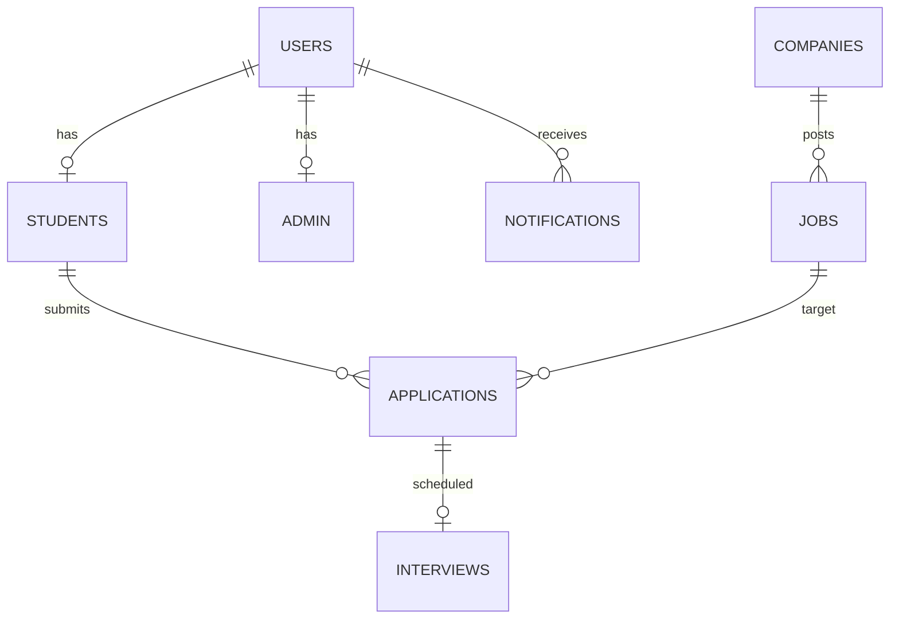

# PlaceSync — College Placement Management System

PlaceSync is a high-performance desktop application designed to streamline and automate college placement operations. Built on **Java Swing (FlatLaf)** for the frontend and **MySQL** for the backend database, it connects student candidates and college administrators (placement officers) on a single platform.

---

## 🏛️ System Architecture Overview
PlaceSync utilizes a modular **Model-View-Controller (MVC)** architectural pattern:

```
  ┌────────────────────────────────────────────────────────┐
  │                        View                            │
  │  (Java Swing + FlatLaf + Custom Styled Components)     │
  └───────────┬────────────────────────────────┬───────────┘
              │                                │
              ▼                                ▼
  ┌───────────────────────┐        ┌───────────────────────┐
  │      Admin Panel      │        │     Student Panel     │
  └───────────┬───────────┘        └───────────┬───────────┘
              │                                │
              ▼                                ▼
  ┌────────────────────────────────────────────────────────┐
  │                     Controllers / DAOs                 │
  │   (AdminDAO, StudentDAO, UserDAO, NotificationDAO)     │
  └───────────────────────────┬────────────────────────────┘
                              │
                              ▼
  ┌────────────────────────────────────────────────────────┐
  │                    Database Layer                      │
  │                 (MySQL via JDBC)                       │
  └────────────────────────────────────────────────────────┘
```

* **Frontend (Views):** Custom Swing components utilizing **FlatLaf (FlatLightLaf)** and custom themes (**Theme.java**) for a modern, responsive layout.
* **Backend (Queries & Utilities):** Modular Data Access Objects (DAOs) executing parameterized SQL queries to safeguard against SQL injection.
* **Security Layer:** Hashing utility that protects user credentials via cryptographic SHA-256 algorithm.

---

## 🗄️ Database Schema & Relationships

The database is built on a schema with foreign-key relationships, triggers, and stored procedures:



### Table Structure Detail

1. **`Users` Table**
   * Stores global account credentials and authorization roles.
   * **Columns:**
     * `user_id` (INT, Primary Key, Auto-Increment)
     * `username` (VARCHAR(50), Unique, Not Null)
     * `password` (VARCHAR(255), Not Null) - *SHA-256 hashed*
     * `role` (ENUM('Admin', 'Student'), Not Null)

2. **`Students` Table**
   * Manages detailed profiles for registered students.
   * **Columns:**
     * `student_id` (INT, Primary Key, Auto-Increment)
     * `user_id` (INT, Foreign Key referencing `Users.user_id`)
     * `name` (VARCHAR(100), Not Null)
     * `branch` (VARCHAR(50))
     * `cgpa` (DECIMAL(3,2))
     * `resume_path` (VARCHAR(255))
     * `placement_status` (ENUM('Placed', 'Unplaced'), Default: 'Unplaced')

3. **`Admin` Table**
   * Identifies administrators linked to administrative users.
   * **Columns:**
     * `admin_id` (INT, Primary Key, Auto-Increment)
     * `user_id` (INT, Foreign Key referencing `Users.user_id`)

4. **`Companies` Table**
   * Registers corporate recruiting partners.
   * **Columns:**
     * `company_id` (INT, Primary Key, Auto-Increment)
     * `name` (VARCHAR(100), Not Null)
     * `location` (VARCHAR(100))

5. **`Jobs` Table**
   * Maintains details about active job postings and eligibility criteria.
   * **Columns:**
     * `job_id` (INT, Primary Key, Auto-Increment)
     * `company_id` (INT, Foreign Key referencing `Companies.company_id`)
     * `role` (VARCHAR(100), Not Null)
     * `package` (DECIMAL(10,2)) - *Package in LPA*
     * `eligibility_cgpa` (DECIMAL(3,2)) - *Minimum CGPA required*

6. **`Applications` Table**
   * Records student application details, status changes, and submission timestamps.
   * **Columns:**
     * `application_id` (INT, Primary Key, Auto-Increment)
     * `student_id` (INT, Foreign Key referencing `Students.student_id`)
     * `job_id` (INT, Foreign Key referencing `Jobs.job_id`)
     * `status` (ENUM('Pending', 'Selected', 'Rejected'), Default: 'Pending')
     * `created_at` (TIMESTAMP, Default: CURRENT_TIMESTAMP)

7. **`Interviews` Table**
   * Tracks scheduled interviews for various applications.
   * **Columns:**
     * `interview_id` (INT, Primary Key, Auto-Increment)
     * `application_id` (INT, Foreign Key referencing `Applications.application_id`)
     * `interview_date` (DATE)
     * `interview_time` (TIME)

8. **`Notifications` Table**
   * Houses alert messages triggered dynamically to target users.
   * **Columns:**
     * `notification_id` (INT, Primary Key, Auto-Increment)
     * `user_id` (INT, Foreign Key referencing `Users.user_id`)
     * `message` (TEXT, Not Null)
     * `is_read` (BOOLEAN, Default: FALSE)
     * `created_at` (TIMESTAMP, Default: CURRENT_TIMESTAMP)

---

## 🔒 Automated Trigger & Procedure Logics
* **Dynamic Placement Update Trigger (`update_placement_status`):**
  A MySQL database trigger automatically executes after any row update in the `Applications` table. If the status changes to `'Selected'`, the student's `placement_status` in the `Students` table is automatically set to `'Placed'`.
* **Eligibility Query Stored Procedure (`GetEligibleStudents`):**
  Accepts a `job_id` and filters out all students whose CGPA is greater than or equal to the job's minimum eligibility criteria.

---

## 🔑 Crucial Features & Business Rules

1. **Anti-Duplicate Application Rule:**
   Before a student submits an application, the system queries the database to ensure they haven't already applied to the same recruiting company (regardless of the specific job role).
2. **Eligibility Validation:**
   The client verifies that the candidate's CGPA matches or exceeds the company's requirement before allowing submission.
3. **Dynamic View Refresh Sync:**
   All Swing views invoke a centralized `refreshData()` mechanism when moving between tab panels, which updates charts, tables, and statistics dynamically.
4. **Interview Scheduler:**
   Administrators can select an application and schedule interviews, creating corresponding records in the `Interviews` table.
5. **Real-time Status Updates:**
   When an admin updates a student's selection status (Selected/Rejected), the system creates an automated notification message, allowing the student to see the decision instantly upon logging in.
6. **Data Portability:**
   Features built-in CSV export options to download placement and application data directly.

---

## 🖥️ UI / Panel Map

### Admin Module
* **Admin Dashboard (`AdminDashboard.java`):** Displays statistics cards (Total Students, Placed Ratio, Active Companies) and dynamic bar/pie charts representing overall placement status and branch-wise statistics.
* **Company Manager (`CompanyManagementPanel.java`):** Interface to register, edit, and delete companies.
* **Job Manager (`JobManagementPanel.java`):** Setup form to define job roles, packages, eligibility guidelines, and link them to registered companies.
* **Application Control (`ApplicationManagementPanel.java`):** Overview table containing **App ID, Student ID, Student Name, Company, Role, Applied Timestamp, Status, and Interview Status**. Includes panel controls to mark selection outcomes, schedule interviews, and export logs to CSV.

### Student Module
* **Student Dashboard (`StudentDashboard.java`):** Overview of personal profile stats and live applications status.
* **Job Discovery (`JobDiscoveryPanel.java`):** Job search list enabling students to filter open roles by company name, package, or job designation, and apply instantly.
* **Student Profile (`StudentProfilePanel.java`):** Personal dashboard to check academic metrics and update resume file paths.
